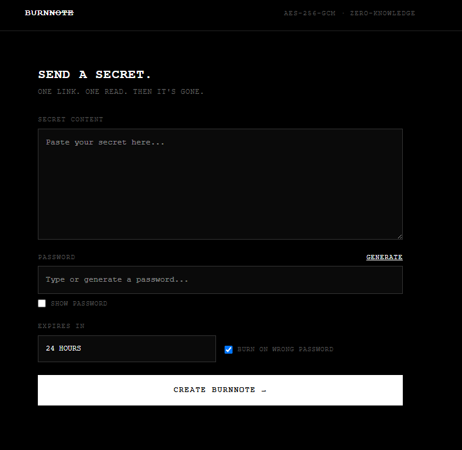

# 🔥 BurnNote
### Notas cifradas de un solo uso con destrucción automática
*Self-hosted, zero-knowledge one-time notes — Share it once. Then it's gone.*

[](LICENSE)
[](https://kit.svelte.dev/)
[](https://developer.mozilla.org/en-US/docs/Web/API/SubtleCrypto)
[](https://en.wikipedia.org/wiki/Zero-knowledge_proof)

---



---

## 🇪🇸 Español

### ¿Qué es BurnNote?

**BurnNote** es una aplicación web autoalojada para compartir secretos de forma segura: contraseñas temporales, claves API, tokens de recuperación, mensajes confidenciales...

Cada nota se destruye automáticamente tras ser leída **una única vez**. Si alguien introduce una contraseña incorrecta, la nota se elimina de forma inmediata e irreversible. El servidor **nunca ve** tu contenido ni tu contraseña — todo se cifra y descifra directamente en el navegador.

---

### 🚀 Uso (Windows)

#### 1. Iniciar BurnNote

Haz doble clic en **`BurnNote.vbs`** desde la carpeta del proyecto.

- Aparecerá una **ventana de carga** negra con una barra animada mientras el servidor arranca y se establece el túnel público.
- La ventana se cierra sola cuando todo está listo.
- El navegador se abre automáticamente con BurnNote.

> No necesitas abrir ninguna terminal. Todo sucede en segundo plano.

#### 2. Crear una nota secreta

1. Escribe o pega tu contenido secreto en el campo **SECRET CONTENT**.
2. Introduce una contraseña en el campo **PASSWORD**, o pulsa **GENERATE** para crear una segura automáticamente.
3. Elige cuánto tiempo debe vivir la nota: 10 minutos, 1 hora, 24 horas o 7 días.
4. (Opcional) Activa **BURN ON WRONG PASSWORD** para destruir la nota si alguien introduce una contraseña incorrecta.
5. Pulsa **CREATE BURNNOTE →**.

#### 3. Compartir la nota

Tras crear la nota, verás:

- 🔗 **ONE-TIME LINK** — el enlace único que debes enviar al destinatario.
- 🔑 **PASSWORD** — la contraseña que necesita para descifrarla.

> ⚠️ **Guarda ambos ahora.** Una vez que el destinatario abra el enlace, la nota desaparece para siempre. Tú tampoco podrás volver a verla.

Envía el enlace por un canal (ej. email) y la contraseña por otro (ej. SMS o Signal) para mayor seguridad.

#### 4. Leer una nota recibida

1. Abre el enlace en el navegador.
2. Introduce la contraseña en el campo que aparece.
3. Pulsa **UNLOCK & DESTROY →**.
4. La nota se descifra en tu navegador y se elimina del servidor al instante.

#### 5. Detener BurnNote

Haz doble clic en **`Detener-BurnNote.bat`** para parar el servidor y el túnel limpiamente.

---

### 🔐 Arquitectura de Seguridad

BurnNote usa cifrado **Zero-Knowledge de extremo a extremo**. El servidor almacena únicamente texto cifrado y hashes — nunca el contenido real ni la contraseña.

```
NAVEGADOR DEL CREADOR
   │
   ├─► Texto secreto + Contraseña
   ├─► PBKDF2-HMAC-SHA-256 (600.000 iteraciones, salt CSPRNG 128-bit)
   │     ├─► K_enc  → cifrado AES-256-GCM
   │     └─► K_auth → verificador de autenticación
   ├─► AES-256-GCM Encrypt(Texto, K_enc, IV de 96 bits)
   └─► Envía al servidor: SHA-256(token) + Ciphertext + IV + Tag + Salt + SHA-256(K_auth)

SERVIDOR BURNNOTE
   ├─► Almacena solo texto cifrado y hashes
   └─► Al recibir intento de lectura:
         ├── Contraseña INCORRECTA → DELETE inmediato + 404
         └── Contraseña CORRECTA  → DELETE atómico + devuelve ciphertext

NAVEGADOR DEL DESTINATARIO
   └─► AES-256-GCM Decrypt → texto plano (nunca sale del navegador)
```

**Primitivas criptográficas:**
| Algoritmo | Uso |
|---|---|
| `AES-256-GCM` | Cifrado autenticado del contenido |
| `PBKDF2-HMAC-SHA-256` | Derivación de claves (600.000 iter.) |
| `SHA-256` | Hash de tokens y verificadores |
| `crypto.getRandomValues` | CSPRNG para IVs, salts y tokens |
| `crypto.timingSafeEqual` | Comparación sin vulnerabilidades timing |

---

### 🛡️ Modelo de Amenazas

**BurnNote protege contra:**
- 🗄️ **Robo de base de datos** — Solo hay ciphertext. Sin password, es basura.
- 🕵️ **Servidor comprometido** — El operador nunca puede leer las notas.
- 🔗 **Adivinación de URLs** — Tokens de 256 bits de entropía hacen imposible el ataque por fuerza bruta.
- 🔁 **Reutilización** — Cada nota solo puede leerse una vez.
- 🔓 **Fuerza bruta de contraseña** — PBKDF2 con 600.000 iteraciones ralentiza los ataques masivamente; activar "Burn on wrong password" los elimina por completo.

**Limitaciones:**
- ⚠️ Si el destinatario comparte su pantalla o un keylogger está activo, el contenido queda expuesto.
- ⚠️ El túnel público (Cloudflare/localtunnel) añade un intermediario de red — úsalo solo en redes de confianza para contenido muy sensible, o despliega con dominio propio.

---

### 📁 Estructura del proyecto

```
burnnote/
├── BurnNote.vbs              ← Lanzador silencioso (doble clic para iniciar)
├── Detener-BurnNote.bat      ← Para el servidor limpiamente
├── scripts/
│   ├── splash.hta            ← Ventana de carga (se abre automáticamente)
│   └── start-with-tunnel.js  ← Servidor + túnel Cloudflare/localtunnel
├── src/
│   ├── lib/
│   │   ├── crypto/
│   │   │   └── noteCrypto.js ← Toda la criptografía (AES-256-GCM, PBKDF2)
│   │   └── server/
│   │       ├── db.js         ← Base de datos SQLite (better-sqlite3)
│   │       └── ratelimit.js  ← Protección contra fuerza bruta
│   └── routes/
│       ├── +page.svelte      ← Página de creación de notas
│       ├── n/[token]/
│       │   └── +page.svelte  ← Página de lectura de notas
│       └── api/notes/        ← API REST (create, status, consume)
├── data/
│   └── burnnote.db           ← Base de datos SQLite (creada automáticamente)
└── build/                    ← Build de producción (generado por npm run build)
```

---

## 🇬🇧 English

### What is BurnNote?

**BurnNote** is a self-hosted web app to securely share sensitive data: temporary passwords, API keys, private tokens, confidential messages...

Each note self-destructs after being read **exactly once**. If a wrong password is entered, the note is permanently and immediately deleted. The server **never sees** your content or your password — everything is encrypted and decrypted entirely in the browser.

---

### 🚀 Usage (Windows)

#### 1. Start BurnNote

Double-click **`BurnNote.vbs`** in the project folder.

- A black **loading window** appears while the server boots and a public tunnel is established.
- The window closes automatically when everything is ready.
- Your browser opens BurnNote automatically.

> No terminal required. Everything runs silently in the background.

#### 2. Create a secret note

1. Type or paste your secret in the **SECRET CONTENT** field.
2. Enter a password, or click **GENERATE** to create a strong one automatically.
3. Choose an expiration: 10 minutes, 1 hour, 24 hours, or 7 days.
4. (Optional) Enable **BURN ON WRONG PASSWORD** to destroy the note on any failed attempt.
5. Click **CREATE BURNNOTE →**.

#### 3. Share the note

After creation you'll see:
- 🔗 **ONE-TIME LINK** — send this to the recipient.
- 🔑 **PASSWORD** — share this separately (different channel).

> ⚠️ **Save both now.** Once the recipient opens the link, the note is gone forever — including for you.

#### 4. Read a received note

1. Open the link in a browser.
2. Enter the password.
3. Click **UNLOCK & DESTROY →**.
4. The note decrypts locally and is deleted from the server immediately.

#### 5. Stop BurnNote

Double-click **`Detener-BurnNote.bat`** to cleanly stop the server and tunnel.

---

### 🛠️ Development

#### Prerequisites
- [Node.js](https://nodejs.org/) v18+

#### Install & Run (dev mode)
```bash
npm install
npm run dev
```

#### Build for production
```bash
npm run build
```
> The `build/` folder is created. `BurnNote.vbs` uses this automatically.

#### Run tests
```bash
npm test
```

---

## 📜 License

Distributed under the **MIT License**. See `LICENSE` for details.
